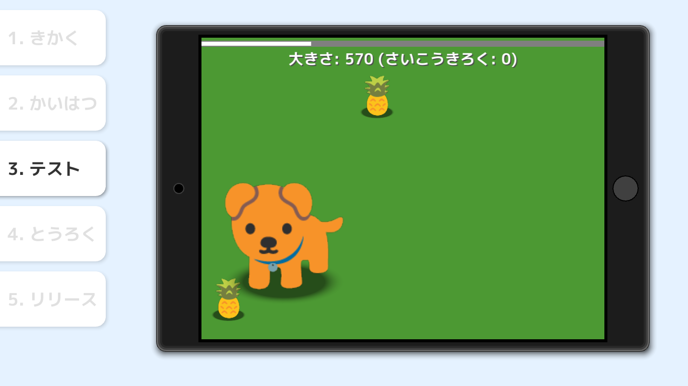

# Siv3D for Kids
Siv3D for Kids (シブスリーディー・フォー・キッズ) は、ゲームやアプリのプログラムの改造を通して、コンピュータープログラミングの体験ができるツールです。対象年齢は 5 歳以上です。

<video src="../images/movie.mp4" controls></video>

## ダウンロード
- 2019 年夏にフリー版 / 有料版を公開予定です

## 作れるゲームの例

