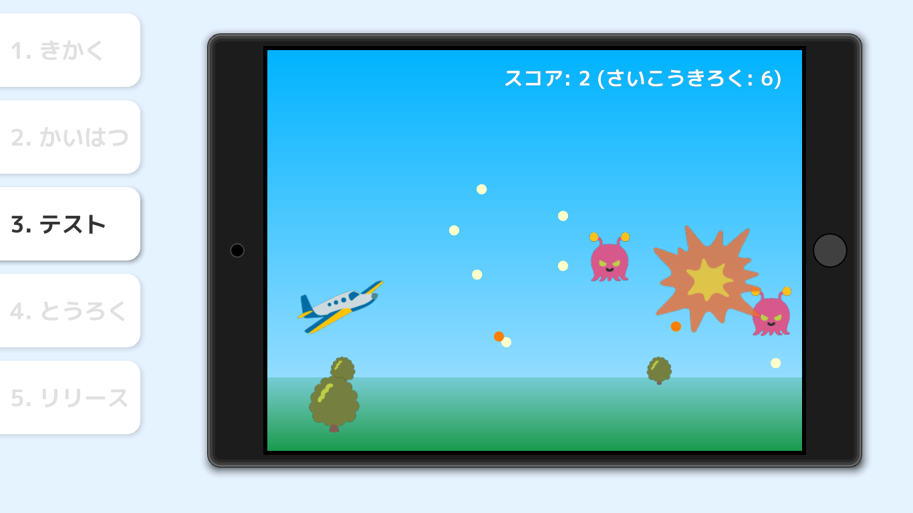

# Siv3D for Kids
Siv3D for Kids (シブスリーディー・フォー・キッズ) は、ゲームやアプリのプログラムの改造を通して、コンピュータープログラミングの体験ができるツールです。対象年齢は 5 歳以上です。

<video src="../images/movie.mp4" controls></video>

## ダウンロード

リンク先の動作条件などをよくご確認ください。

### Siv3D for Kids 無料体験版
- [Siv3D for Kids Free【無料体験版】をダウンロード](https://siv3d.booth.pm/items/1476896)
- 2 種類のゲームが遊べます
- 有料版の購入前の動作確認にご利用ください

### Siv3D for Kids
- [Siv3D for Kids【1 年間アップデート付き】を購入](https://siv3d.booth.pm/items/1476917)
- 6 種類のゲームが遊べます（無料アップデートで最大 12 種類のゲーム・アプリに）
- 1 回購入すれば半永久的に再ダウンロード可能です
- 2020 年夏まで、継続的に無料のアップデート（機能の強化と追加コンテンツ）が提供されます

#### アップデート履歴
- 2019-07-27: 最初のバージョン (6 種類のゲーム)

#### 今後のアップデート予定
- 追加のゲーム・アプリ
- macOS 対応
- カスタマイズできる項目の追加
- チュートリアルの導入
- 保護者向けガイド
- 先生向けの機能

## 作れるゲームの例

